# Customer Outreach Campaign Tools

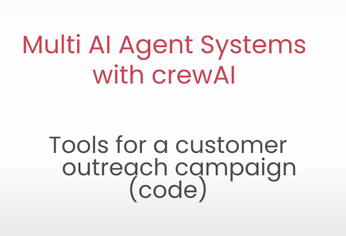

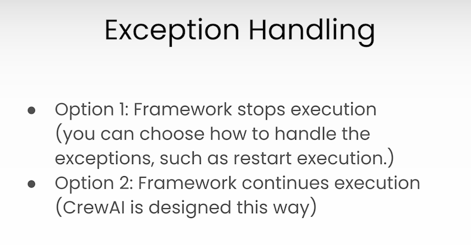

## Mental Framework for agent creation

Think as a manager

- What is the goal
- What is the process
- What kind of people would i need to hire to get this done

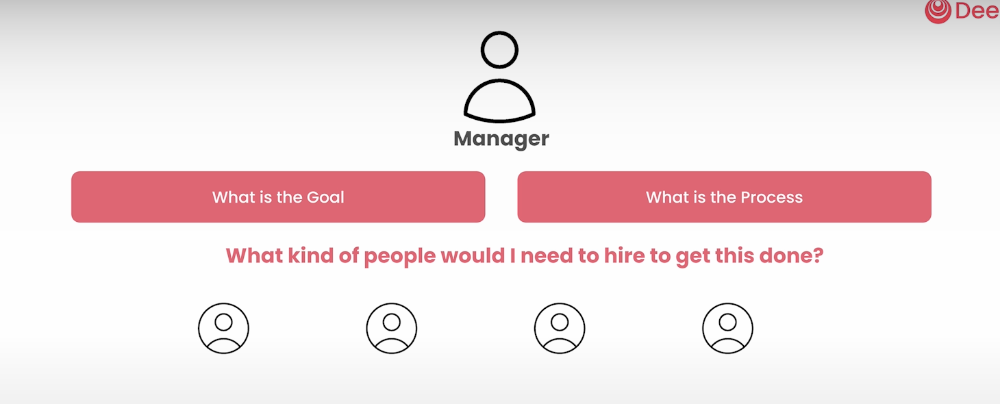

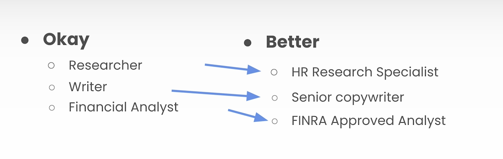

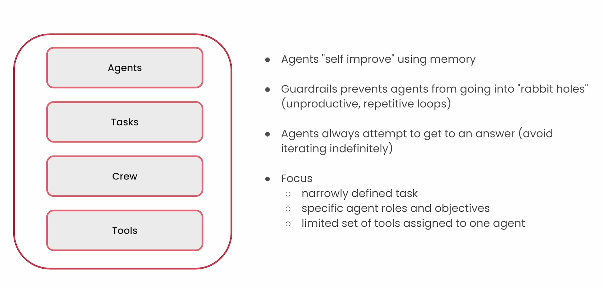

## TOOLS

- Will allow agents to communicate with the external world
- Makes agents great

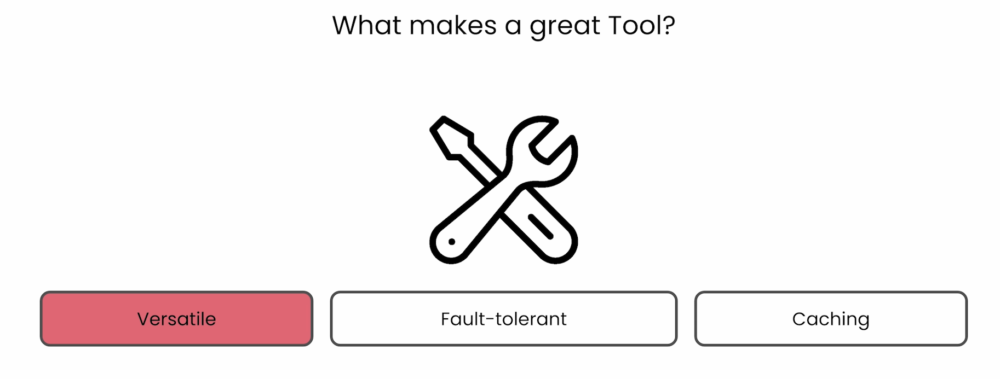

## VERSATILE

Accept different kind of requests

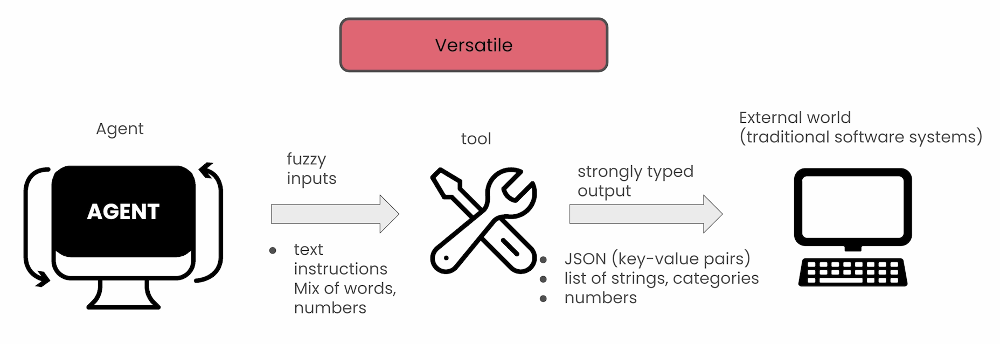

## FAULT TOLERANT

Fail Gracefully and self heal

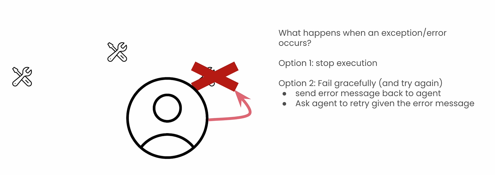

## CACHING

Prevent unnecessary request
Crew AI - Cross Agent Caching
Different Agent query the same piece of information which was requested by another agent before, it will be retrieved through cache

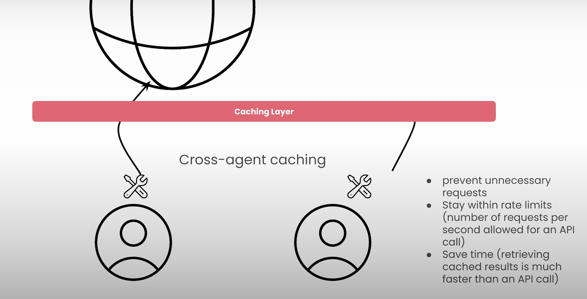

## CREW AI TOOLS

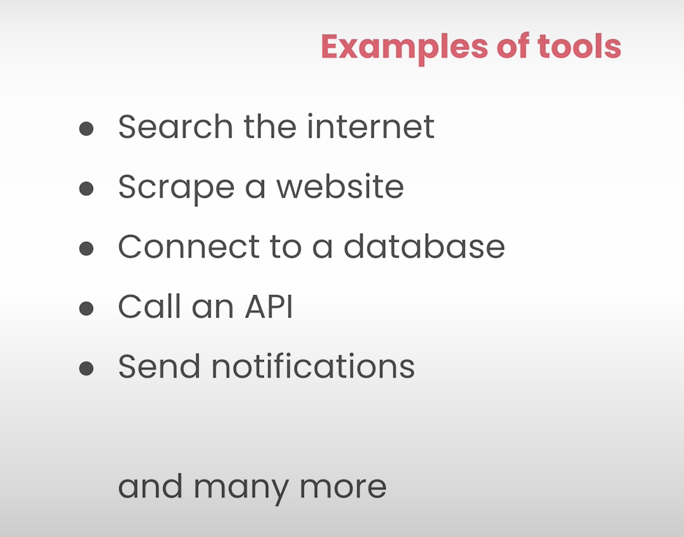

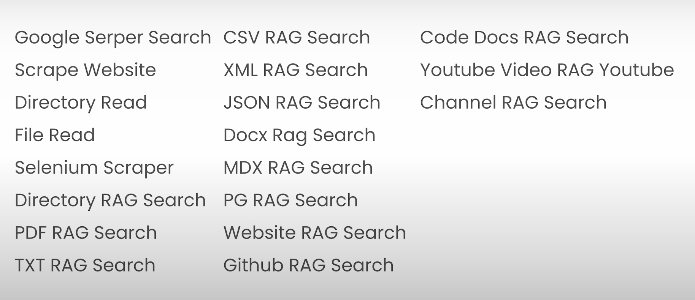

---

## YT RECORDING

---

